# taskflow-gitops — dépôt GitOps du cours CI/CD M2

Ce dépôt décrit **l'état voulu** de l'application TaskFlow dans Kubernetes.
Argo CD le surveille et aligne le cluster dessus : pour changer la production,
on ne tape pas de commande, on fait une **Pull Request**.

## Installation (à faire chez vous, avant le cours)

Prérequis : Docker Desktop démarré, 8 Go de RAM, 10 Go de disque libre.
Sous Windows : WSL2 (Ubuntu) + intégration WSL de Docker Desktop, et toutes les commandes dans WSL.

```bash
git clone https://github.com/9m7fjfpv9k-cyber/taskflow-gitops.git
cd taskflow-gitops
./scripts/install.sh
```

Le script crée un cluster local `kind`, installe Argo CD et Argo Rollouts,
puis télécharge les images des labs. Comptez 5 à 15 minutes.
Il peut être relancé sans risque.

## Structure

| Chemin | Rôle |
| --- | --- |
| `apps/taskflow/` | Les manifests surveillés par Argo CD |
| `argocd/application.yaml` | Déclare l'application dans Argo CD |
| `exemples/bluegreen/` | Manifests pour le déploiement Blue-Green |
| `exemples/canary/` | Manifests pour le déploiement Canary |
| `exemples/robustesse/` | Canary avec test de charge k6 automatique, modèle de postmortem |
| `exemples/ci/` | Pipelines de la mini-PSSI (GitHub Actions et GitLab CI) |
| `policies/` | Mini-PSSI et règles Rego vérifiées par conftest |
| `scripts/install.sh` | Installation de l'environnement |
| `scripts/argocd-ui.sh` | Ouvre l'interface d'Argo CD |
| `scripts/observe.sh` | Montre quelle version répond, et avec quel code HTTP |
| `scripts/charge.sh` | Lance à la main le test de charge k6 contre un service |

## Images disponibles

`ghcr.io/9m7fjfpv9k-cyber/taskflow` en versions `1.0.0`, `1.1.0`, `2.0.0`, `2.1.0` et `2.2.0`.

## Équipe

- arosfa (seul, sans binôme)

## Labo 1 : déployer par PR, dérive, retour arrière

Auteur : arosfa. Labo fait seul, sans binôme. Commencé en fin de séance le 7 octobre, continué le soir et dans la nuit.
Fork : https://github.com/arosfa/taskflow-gitops

Étapes 1 à 4 réalisées et documentées ci-dessous. Bonus non réalisé.

Environnement : cluster kind `kind-cicd` sur macOS, Argo CD v3.5.3, relecture de Git toutes les 60 s.
Argo CD surveille la branche `main`, dossier `apps/taskflow`, avec `selfHeal` et `prune` activés.

### Journal des déploiements

| Date et heure | Action | PR / commit | Ce que j'ai observé | Qui a agi |
|---|---|---|---|---|
| 7 oct., non relevée | `kubectl apply -f argocd/application.yaml` | - | 1.0.0, 4 pods, Synced + Healthy | moi (déclaration), Argo CD (déploiement) |
| 7 oct., entre 12:18 et 12:31 | Merge de « Passer TaskFlow en image 2.0.0 » | PR #1, commit `fe71d47` | 1.0.0 juste avant | moi, dans Git |
| 7 oct., avant 12:31:28 | Synchronisation automatique | `fe71d47` | 2.0.0 | Argo CD |
| 7 oct., 12:31:28 | Contrôle avec `observe.sh` | - | 40 réponses `version=2.0.0 http=200` | - |
| 8 oct., 01:18:28 | Dérive : `kubectl scale --replicas=1` | aucun commit | 1 pod, puis 4 pods prêts 7 s après | moi (dérive), Argo CD (correction) |
| 8 oct., 01:19:34 | Dérive : `kubectl set image` en 1.1.0 | aucun commit | 1.1.0, puis retour en 2.0.0 avant 01:24:54 | moi (dérive), Argo CD (correction) |
| 8 oct., 01:38 | Merge de « Revert "Passer TaskFlow en image 2.0.0" » | PR de revert, commit `1eafca6` | retour en 1.0.0 constaté à 01:38:16 | moi (dans Git), Argo CD (déploiement) |

Les heures exactes des deux merges sont visibles sur les PR.

### 1. Premier déploiement (1.0.0)

`kubectl apply -f argocd/application.yaml` ne déploie rien lui-même : il déclare l'application à Argo CD.
C'est Argo CD qui lit ensuite le dépôt et crée le namespace, le Deployment et le Service.
Résultat : 4 pods en image 1.0.0, application Synced et Healthy, `observe.sh` : 40 réponses `version=1.0.0 http=200`.

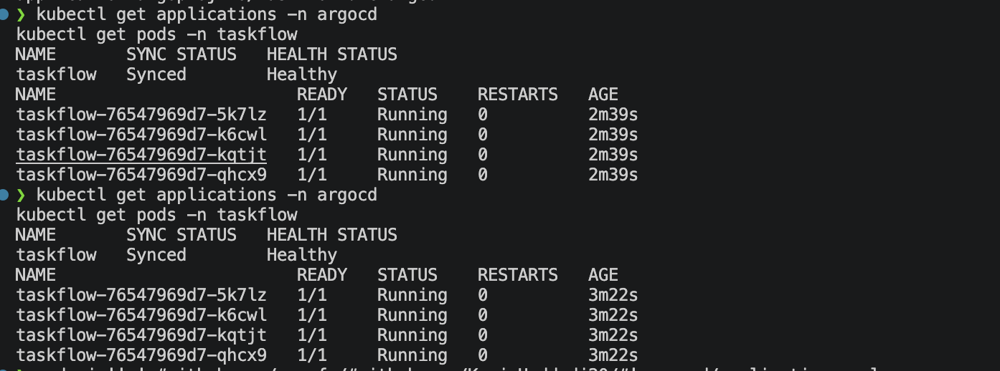

### 2. Déploiement de la 2.0.0 par PR

La PR #1 change une seule ligne de `apps/taskflow/deployment.yaml` : l'image passe de 1.0.0 à 2.0.0.
Après le merge, aucune commande n'a été lancée sur le cluster. Argo CD a vu le nouveau commit
à sa relecture suivante de Git, puis a remplacé les pods.
Délai : non chronométré précisément. La 2.0.0 était en place au contrôle de 12:31:28.

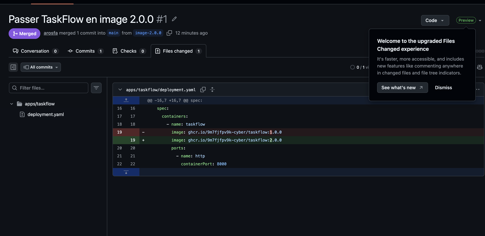

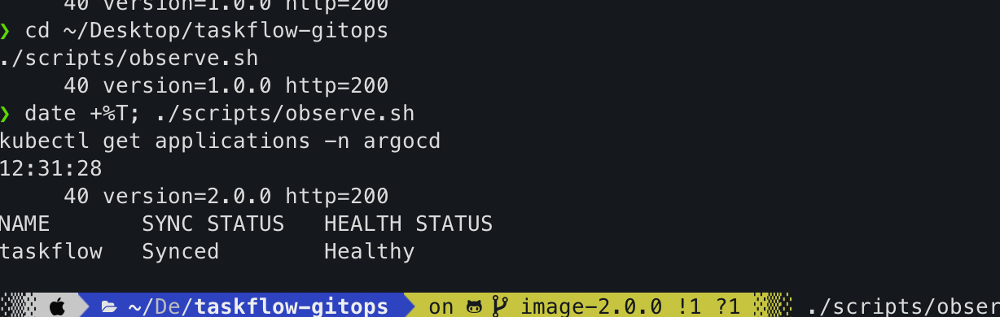

### 3. Dérive, puis correction par Argo CD

Git demande 4 pods en image 2.0.0. J'ai changé le cluster à la main avec `kubectl`, sans toucher à Git,
pour voir si Argo CD s'en rendait compte.

**Dérive 1 : le nombre de pods (8 oct.)**

| Heure | Ce qui se passe |
|---|---|
| 01:18:28 | `kubectl scale --replicas=1` : le Deployment affiche `1/1` |
| 01:18:31 | `1/4` : Argo CD a remis 4 pods voulus, 3 s après |
| 01:18:35 | `4/4` : tout est revenu, 7 s après ma commande |

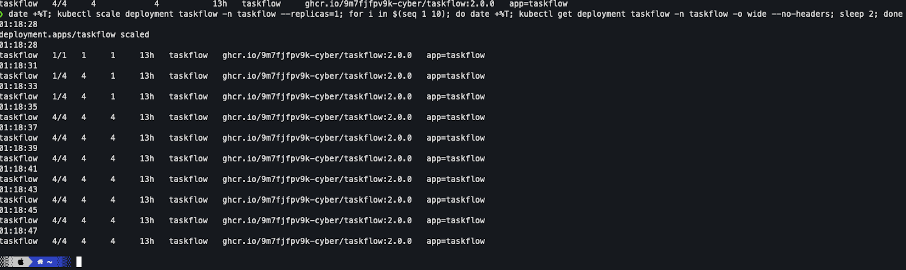

**Dérive 2 : l'image (8 oct.)**

| Heure | Ce qui se passe |
|---|---|
| 01:19:34 | `kubectl set image` : l'image passe en 1.1.0 |
| 01:22:36 | toujours 1.1.0, 3 minutes après |
| 01:24:54 | l'image est revenue en 2.0.0, application Synced et Healthy |

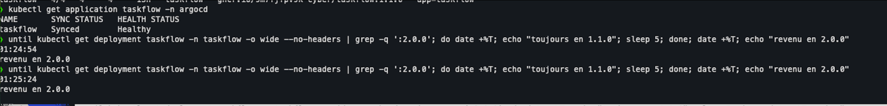

**Mon analyse**

Kubernetes a obéi à mes commandes : c'est l'ouvrier, il fait ce qu'on lui dit. Argo CD, lui, compare
le cluster à Git, comme un chef de chantier qui vérifie que le chantier suit le plan. Quand il voit
un écart, il redonne la consigne de Git.

Les deux fois, je n'ai rien corrigé moi-même et Git n'a reçu aucun commit. Ce que j'avais fait
à la main a disparu.

Ce qui m'a surpris, c'est le délai. Les pods sont revenus en 3 s, mais l'image a mis entre 3 et 5 minutes.
La veille, la même dérive sur l'image avait été corrigée en 2 s. Mon hypothèse, non vérifiée : Argo CD
attend de plus en plus longtemps quand les dérives s'enchaînent. `selfHeal` est donc automatique,
mais pas toujours immédiat.

Ce que je retiens : pour changer le cluster pour de bon, il faut changer Git, par une PR.

### 4. Revert : retour à l'image 1.0.0

J'ai cliqué sur le bouton Revert de la PR #1. GitHub a créé tout seul une nouvelle PR,
« Revert "Passer TaskFlow en image 2.0.0" », qui fait l'inverse de la première : la ligne de l'image
repasse de 2.0.0 à 1.0.0. Je n'ai rien eu à pousser depuis ma machine.

| Heure (8 oct.) | Ce qui se passe |
|---|---|
| juste avant 01:38:04 | merge de la PR de revert (heure exacte sur la PR) |
| 01:38:04 | je lance la surveillance du cluster |
| 01:38:16 | 4 pods prêts sur 4 en image 1.0.0 |

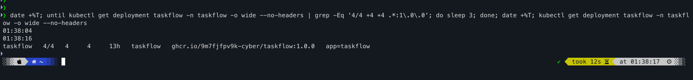

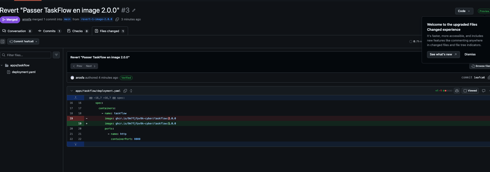

**Mon analyse**

Cette fois, le changement a tenu, contrairement à la dérive. La différence : j'ai changé Git, le plan,
et pas le cluster directement. Argo CD a lu le nouveau commit et a déployé la 1.0.0 lui-même.

Le retour arrière n'efface rien : l'historique garde la PR #1 (passage en 2.0.0) puis la PR de revert
qui l'annule. On voit qui a fait quoi, et quand.

Le délai a été court, une douzaine de secondes. Argo CD relit Git toutes les 60 s : j'ai sans doute
mergé juste avant une relecture.

### 5. Bonus prune : non réalisé

### Réponses

**Push ou pull ?** Pull. Le merge n'a rien envoyé au cluster, qui tourne en local et que GitHub
ne peut pas joindre. C'est Argo CD, depuis le cluster, qui interroge Git toutes les 60 s et applique
ce qu'il y trouve.

**Qui a corrigé quoi ?** Pour le déploiement, j'ai corrigé Git (PR #1) et Argo CD a aligné le cluster.
La dérive a été corrigée par Argo CD seul, grâce à `selfHeal` : je n'ai rien fait et Git n'a reçu aucun commit.
Pour le retour arrière, j'ai corrigé Git avec la PR de revert, puis Argo CD a remis la 1.0.0 dans le cluster.

**Pourquoi git revert ?** Parce que Git est la source de vérité. La dérive me l'a montré : un changement fait
à la main avec `kubectl` est annulé par Argo CD. Pour revenir en 1.0.0 pour de bon, il fallait changer Git.
Le revert le fait proprement : il ajoute un commit qui annule le précédent, sans réécrire l'historique,
et il passe par une PR comme tout le reste.

### Ce qui m'a posé problème

- Le script d'installation s'arrêtait sur Argo Rollouts (« annotations: Too long »). Corrigé en ajoutant
  `--server-side --force-conflicts` au `kubectl apply` de Rollouts.
- Ma première PR partait vers le dépôt du prof au lieu de mon fork : GitHub propose le dépôt d'origine
  par défaut. Il faut changer le « base repository ».
- J'ai committé mes captures sans avoir enregistré le README : la PR ne contenait que les images.
- Le cluster ne répondait plus (« connection refused ») : Docker Desktop s'était arrêté.
  C'est là que j'ai compris que le cluster kind vit dans Docker.
- Pour le revert, je cherchais comment pousser depuis mon terminal. En fait, le bouton Revert fait tout
  sur GitHub : il crée la branche, le commit et la PR.
- Au début, je mélangeais les rôles de Git, Kubernetes et Argo CD. L'image du chantier m'a débloqué.

### Ce que je retiens

Pendant tout le labo, je n'ai lancé aucune commande de déploiement. J'ai changé Git, et Argo CD a fait le reste.
Les seules fois où j'ai touché au cluster directement, ça n'a pas tenu.

## Labo 2 : Blue-Green puis Canary avec Argo Rollouts

Fait seul le 8 octobre, de 09:25 à 09:53. Parcours : 1.0.0 → Blue-Green → 1.1.0 → Canary → 2.0.0, puis essai de la 2.1.0 et abort.

La règle reste la même que dans le premier labo : chaque changement passe par une PR, et c'est Argo CD qui l'applique.
La nouveauté : un Rollout remplace le Deployment, et c'est Argo Rollouts qui gère le passage d'une version à l'autre.

### Journal des déploiements

| Heure (8 oct.) | Action | PR / commit | Ce que j'ai observé | Qui a agi |
|---|---|---|---|---|
| vers 09:25 | Merge de « Remplacer le Deployment par un Rollout Blue-Green » | PR #5, commit `972c496` | à 09:27:07 : Rollout Healthy, 4 nouveaux pods en 1.0.0, anciens pods du Deployment supprimés | moi (Git), Argo CD (déploiement et prune) |
| vers 09:30 | Merge de « Blue-Green : image 1.1.0 » | commit `26f26a0` | à 09:32:02 : Rollout en pause, 8 pods (4 en 1.0.0, 4 en 1.1.0) | moi (Git), Argo CD, Argo Rollouts |
| 09:33:13 | `observe.sh` sur les deux Services | - | `taskflow` : 40 × 1.0.0, `taskflow-preview` : 40 × 1.1.0 | - |
| 09:33:20 | `promote` | - | `taskflow` : 40 × 1.1.0 juste après | moi (promote), Argo Rollouts (bascule) |
| vers 09:38 | Merge de « Canary : Rollout canary en image 1.1.0 » | commit `a005f00` | à 09:38:59 : stratégie Canary, 4 pods en 1.1.0, aucun redémarrage | moi (Git), Argo CD |
| vers 09:40 | Merge de « Canary : image 2.0.0 » | commit `7b16617` | à 09:40:56 : pause à 25 %, 1 pod en 2.0.0 et 3 en 1.1.0, 33 réponses en 1.1.0 et 7 en 2.0.0 | moi (Git), Argo CD, Argo Rollouts |
| 09:42:47 | `promote` | - | 50 %, 75 % puis 100 % sans intervention ; à 09:44:34 : 4 pods en 2.0.0, 40 × 2.0.0 | moi (promote), Argo Rollouts (paliers) |
| vers 09:45 | Merge de « Canary : image 2.1.0 » | commit `a5bce6a` | à 09:47:35 : pause à 25 %, 1 pod en 2.1.0, des réponses `http=500` (1 puis 6 sur 40) | moi (Git), Argo CD, Argo Rollouts |
| 09:48:10 | `abort` | - | à 09:48:25 : 4 pods en 2.0.0, 40 × `http=200`, Rollout Degraded, application Synced + Degraded | moi (abort), Argo Rollouts |
| vers 09:52 | Merge du revert de la PR 2.1.0 | PR de revert | à 09:53:12 : Rollout Healthy en 2.0.0, application Synced + Healthy | moi (Git), Argo CD |

Les heures exactes des merges sont visibles sur les PR.

### A. Blue-Green : de 1.0.0 à 1.1.0

**A1. Le Rollout remplace le Deployment.** J'ai supprimé `deployment.yaml` et copié les trois fichiers de `exemples/bluegreen/`
dans `apps/taskflow/`. Après le merge, Argo CD a créé le Rollout avec 4 nouveaux pods en 1.0.0 et a supprimé
les pods de l'ancien Deployment, puisque son fichier n'était plus dans Git (`prune`).

*Capture ci-dessous (09:27:07) : le Rollout est Healthy, stratégie BlueGreen, 4 pods en 1.0.0.*

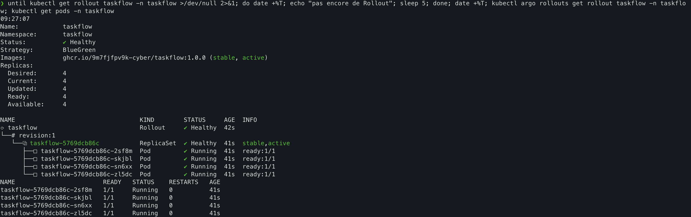

**A2 et A3. La nouvelle version démarre à côté.** Après la PR qui passe l'image en 1.1.0, le Rollout s'est mis en pause.
Il y avait 8 pods : 4 bleus en 1.0.0 (`stable, active`) et 4 verts en 1.1.0 (`preview`).
La production répondait toujours en 1.0.0 (40 sur 40), et seul le Service `taskflow-preview` répondait en 1.1.0 (40 sur 40).

*Capture ci-dessous (09:32:02) : le Rollout est en pause, avec 8 pods, 4 en 1.0.0 et 4 en 1.1.0.*

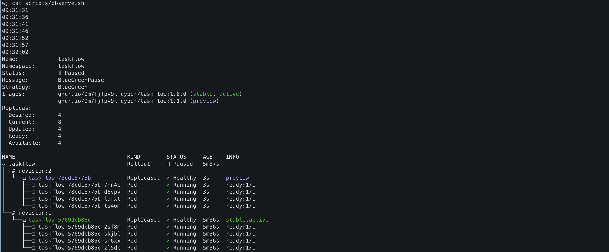

**A4. La bascule.** À 09:33:20, j'ai lancé `promote`. La mesure suivante sur la production donnait 40 réponses sur 40 en 1.1.0,
sans aucune erreur. Les pods bleus sont restés 30 secondes (`scaleDownDelaySeconds`), puis ont été supprimés :
à 09:34:03, il ne restait que les 4 pods en 1.1.0.

*Capture ci-dessous (09:33:13, 09:33:20 et 09:34:03) : observe.sh sur les deux Services, le promote, la production en 1.1.0, puis les pods bleus supprimés.*

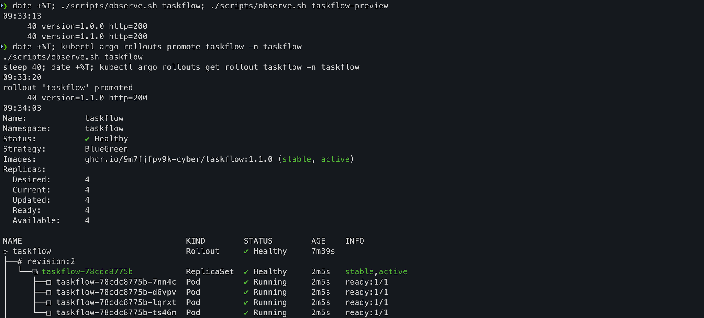

**Mon analyse du Blue-Green**

Avant la bascule, aucun utilisateur n'a vu la 1.1.0 : j'ai pu la tester sur la preview pendant que la production tournait normalement.
La bascule a été nette : tout en 1.0.0, puis tout en 1.1.0, sans mélange. Et pendant 30 secondes,
l'ancienne version était encore là, prête à reprendre si besoin.

Le prix à payer se lit dans la capture : 8 pods au lieu de 4 pendant la transition, donc le double de ressources.

### B. Canary : de 1.1.0 à 2.0.0, puis la 2.1.0

**B1. Changer de stratégie.** J'ai remplacé le Rollout par celui de `exemples/canary/`, en gardant l'image 1.1.0.
Les pods n'ont pas redémarré : seule la façon de déployer a changé, pas la version.

*Capture ci-dessous (09:38:59) : stratégie Canary, 4 pods en 1.1.0.*

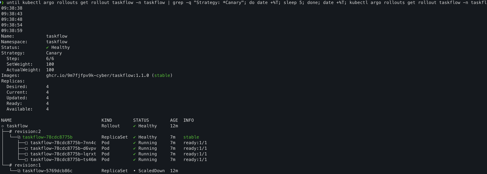

**B2. La 2.0.0 par paliers.** Après la PR, le Rollout s'est arrêté au premier palier : 1 pod en 2.0.0 (`canary`) et 3 en 1.1.0 (`stable`).
`observe.sh` a donné 33 réponses en 1.1.0 et 7 en 2.0.0.

*Capture ci-dessous (09:40:56) : pause à 25 %, 1 pod en 2.0.0 et 3 en 1.1.0, réponses mélangées.*

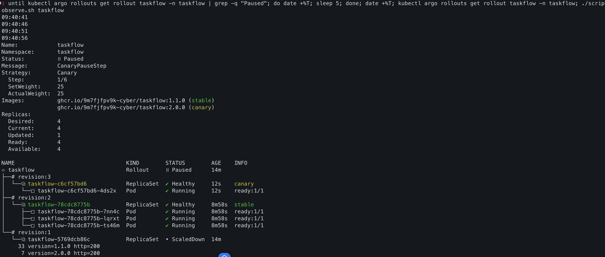

Après mon `promote` de 09:42:47, les paliers suivants se sont enchaînés tout seuls : 50 % avec 60 s de pause,
75 % avec 30 s de pause, puis 100 %. À 09:44:34, les 4 pods étaient en 2.0.0 et les 40 réponses aussi.
Les pods avaient des âges différents (de 6 s à presque 4 min) : ils ont bien été remplacés un par un.

*Capture ci-dessous (09:42:47) : le promote, puis le palier à 50 %.*

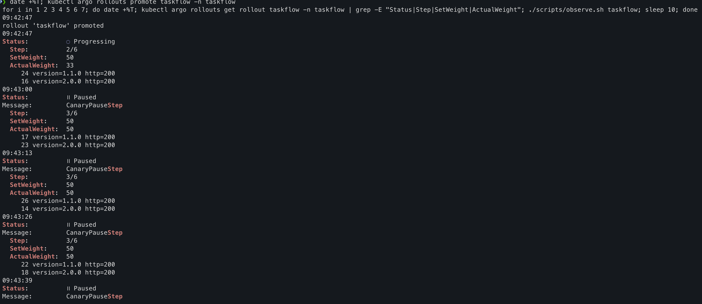

**B3. La 2.1.0 et l'abort.** Au palier de 25 %, `observe.sh` a montré des erreurs : 1 réponse `http=500` sur 40,
puis 6 sur 40 à la mesure suivante. Les réponses en 2.0.0 étaient toutes en `http=200`.
Pourtant, le pod en 2.1.0 était `Running` et `Healthy` pour Kubernetes.

*Capture ci-dessous (09:47:35) : pause à 25 % en 2.1.0, avec des réponses http=500.*

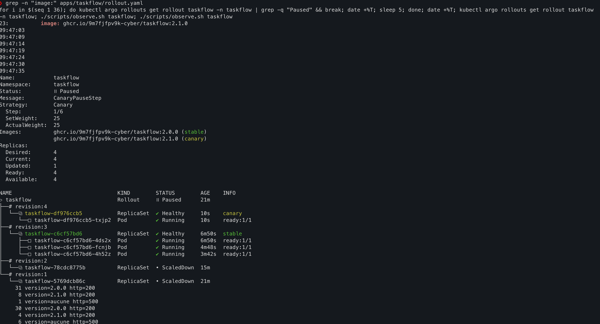

À 09:48:10, j'ai lancé `abort`. Quinze secondes plus tard, le pod en 2.1.0 avait disparu,
4 pods tournaient en 2.0.0 et les 40 réponses étaient en `http=200`.

*Capture ci-dessous (09:48:10) : après l'abort, Rollout Degraded et application Synced + Degraded.*

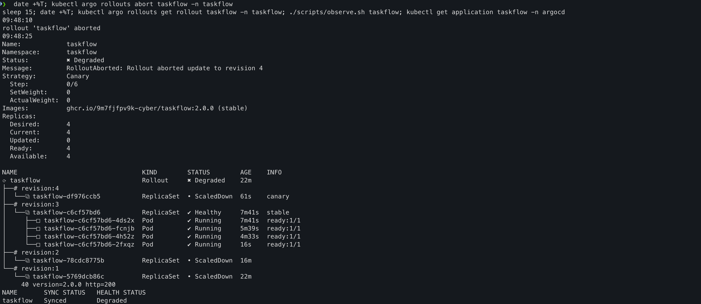

**Et après l'abort ?** Les utilisateurs étaient protégés, mais rien n'était réglé. Le Rollout était `Degraded`
et l'application `Synced` mais `Degraded` : Git demandait toujours la 2.1.0. L'abort est un frein d'urgence, pas une réparation.
J'ai donc fait un revert de la PR 2.1.0. À 09:53:12, le Rollout était de nouveau `Healthy` en 2.0.0
et l'application `Synced` et `Healthy`.

*Capture ci-dessous (09:53:12) : après le revert, tout est Healthy en 2.0.0.*

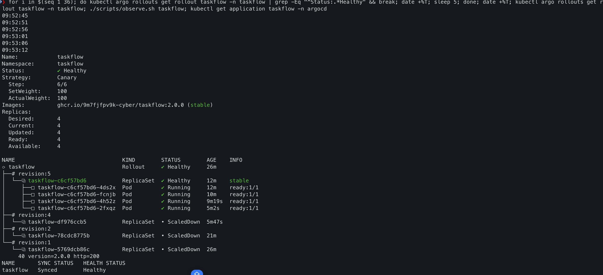

**Mon analyse du Canary**

Le Canary expose de vrais utilisateurs, mais peu à la fois. Avec la 2.1.0, quelques requêtes ont échoué,
alors qu'une bascule complète aurait touché tout le monde.

Deux choses m'ont marqué. D'abord, Kubernetes ne voyait pas le bug : le pod était en bonne santé, et seules les vraies requêtes
montraient les erreurs 500. Ensuite, le « 25 % » n'est pas un vrai pourcentage ici : sans routeur de trafic, c'est 1 pod sur 4,
et la répartition des requêtes est aléatoire. J'ai mesuré 7 réponses sur 40 en 2.0.0, soit 17,5 %.

### promote et abort : est-ce une dérive ?

Ce sont des commandes lancées directement sur le cluster, comme le `kubectl scale` du premier labo.
Mais Argo CD ne les a pas annulées. La différence, telle que je la comprends : `promote` et `abort` ne changent pas
ce que Git décrit, ils pilotent seulement l'avancement du Rollout. L'abort laisse quand même un écart entre ce qui tourne (2.0.0)
et ce que Git demande (2.1.0), et c'est pour ça qu'il a fallu corriger Git ensuite.

### Blue-Green ou Canary pour TaskFlow ?

Pour TaskFlow, je choisirais le Blue-Green.

**Le risque.** En Blue-Green, aucun utilisateur n'a vu la nouvelle version avant ma bascule : la production répondait
40 fois sur 40 en 1.0.0 pendant que je testais la preview. En Canary, de vrais utilisateurs ont reçu la version boguée :
avec la 2.1.0, jusqu'à 6 requêtes sur 40 ont fini en erreur 500 avant mon abort. Je pense que j'aurais pu voir ce bug
en lançant `observe.sh` sur `taskflow-preview`, sans toucher un seul utilisateur.

**Le coût.** Le Blue-Green a demandé 8 pods au lieu de 4 pendant la transition. Pour TaskFlow, 4 petits pods
de plus pendant quelques minutes, c'est peu. Le Canary est resté à 4 pods.

**La limite du Canary ici.** Sans routeur de trafic, le plus petit palier est 1 pod sur 4, donc environ un quart des requêtes.
C'est beaucoup pour un premier test.

Je changerais d'avis dans trois cas : si l'application avait beaucoup plus de pods, parce que tout doubler coûterait cher ;
si on avait un routeur de trafic pour n'envoyer que 1 ou 5 % des requêtes ; ou si le bug ne se voyait qu'avec du vrai trafic.

### Ce qui m'a posé problème dans ce labo

- J'ai lancé deux fois le même bloc de commandes. La branche existait déjà, donc mon commit est parti sur `main`
  en local et la PR était vide. Corrigé en ramenant le commit sur la bonne branche.
- GitHub m'a encore proposé le dépôt du prof comme cible de PR. J'utilise maintenant un lien direct de comparaison dans mon fork.
- Après un merge, le cluster ne change pas tout de suite : il faut attendre la relecture de Git par Argo CD, jusqu'à une minute.

### Ce que je retiens

Argo CD décide de ce qui doit tourner, à partir de Git. Argo Rollouts décide de la manière d'y arriver, en Blue-Green ou en Canary.
Dans les deux cas, quand ça se passe mal, la vraie correction se fait dans Git.

## Labo 3 : analyse automatique, incident 2.1.0 et postmortem

Fait seul le 8 octobre, de 11:09 à 14:06. Parcours prévu : 2.0.0 → 2.1.0 → abandon automatique → 2.2.0.
Le postmortem complet est dans [docs/postmortem-2.1.0.md](docs/postmortem-2.1.0.md).

### En bref

Au labo 2, c'est moi qui avais vu les erreurs de la 2.1.0 et lancé `abort`. Ici, un test de charge k6 doit le faire tout seul,
au palier de 25 %. Chez moi, ça ne s'est pas passé comme prévu : le test a accepté la 2.1.0, elle est partie en production,
puis le même test a refusé le retour à la version saine. J'ai cherché pourquoi, corrigé le test en trois lignes, et refait l'essai :
la 2.1.0 a alors été refusée automatiquement, et la 2.2.0 acceptée. Je n'ai pas désactivé l'analyse k6 : je l'ai réparée.

### Journal des déploiements

| Heure (8 oct.) | Action | PR / commit | Ce que j'ai observé | Qui a agi |
|---|---|---|---|---|
| vers 11:10 | Synchronisation du fork avec le dépôt du cours | PR `sync-prof`, commit `6b08cec` | `exemples/robustesse/` et `scripts/charge.sh` récupérés | moi (Git) |
| 11:17:54 | Étalon : `./scripts/charge.sh http://taskflow` | - | 2.0.0 : 0,00 % d'erreurs, p95 = 5,43 ms | moi |
| vers 11:24 | Merge de « Canary avec analyse automatique k6 » | PR #13, commit `ffda5c9` | à 11:26:34 : AnalysisTemplate, ConfigMap et Service `taskflow-canary` créés | moi (Git), Argo CD |
| vers 11:33 | Merge de « Image 2.1.0 » | PR #14, commit `f86e196` | vers 11:36 : AnalysisRun **Successful**, puis 2.1.0 à 100 % vers 11:38 | moi (Git), Argo CD, Argo Rollouts |
| 11:54:51 | Contrôle avec `observe.sh` | - | 2.1.0 en production, 25 % de `http=500` | moi |
| vers 12:06 | Merge du revert de la PR #14 | PR de revert | à 12:08:05 : AnalysisRun **Failed**, retour abandonné, production toujours en 2.1.0 | moi (Git), Argo Rollouts |
| 12:18:52 | `kubectl argo rollouts promote taskflow --full` | - | à 12:19:09 : Healthy en 2.0.0, fin de l'incident | moi (commande), Argo Rollouts |
| vers 12:27 | Merge de « Analyse : pause avant k6 et connexions non réutilisées » | commit `b003c5b` | à 12:28:19 : correction en place, production inchangée | moi (Git), Argo CD |
| vers 12:29 | Merge de « Image 2.1.0 (après correction de l'analyse) » | PR #17 | à 12:31:18 : AnalysisRun **Failed**, abandon automatique, production restée en 2.0.0 | moi (Git), Argo Rollouts (abandon) |
| vers 13:58 | Merge du revert de la PR #17 | PR de revert | à 14:00:10 : Rollout Healthy, application Synced | moi (Git), Argo CD |
| vers 14:03 | Merge de « Image 2.2.0 » | commit `49f7d42` | à 14:04:29 : AnalysisRun **Successful** ; à 14:05:42 : Healthy en 2.2.0 à 100 % | moi (Git), Argo CD, Argo Rollouts |

Les heures précédées de « vers » ne sont pas chronométrées. Les heures exactes des merges sont visibles sur les PR.

### A. L'étalon et l'analyse automatique

**L'étalon.** Avant de changer quoi que ce soit, j'ai mesuré la version saine. C'est la référence de tout le labo.

```
11:17:54
Status:          ✔ Healthy
Images:          ghcr.io/9m7fjfpv9k-cyber/taskflow:2.0.0 (stable)
    http_req_duration
    ✓ 'p(95)<250' p(95)=5.43ms
    http_req_failed
    ✓ 'rate<0.02' rate=0.00%
    http_req_failed................: 0.00% 0 out of 735
Résultat : seuils respectés.
```

**L'analyse.** J'ai copié les fichiers de `exemples/robustesse/` dans `apps/taskflow/` (PR #13). Je n'avais plus de `deployment.yaml` à supprimer :
il l'avait été au labo 2. Le Rollout lance maintenant un test k6 au palier de 25 %, à travers le Service `taskflow-canary`.

```
11:26:34
analysistemplate.argoproj.io/robustesse-k6   1s
configmap/k6-robustesse      1      1s
service/taskflow-canary   ClusterIP   10.96.247.74   <none>        80/TCP    1s
Status:          ✔ Healthy
Images:          ghcr.io/9m7fjfpv9k-cyber/taskflow:2.0.0 (stable)
```

### B. L'incident

**B1. Premier essai : la 2.1.0 passe.** Après le merge de la PR #14, je n'ai touché à rien. L'analyse a réussi et la 2.1.0 est allée jusqu'à 100 %.

```
11:54:51
Status:          ✔ Healthy
Images:          ghcr.io/9m7fjfpv9k-cyber/taskflow:2.1.0 (stable)
│  └──α taskflow-df976ccb5-6-1                                       AnalysisRun  ✔ Successful  19m   ✔ 1
     28 version=2.1.0 http=200
     12 version=aucune http=500
```

**B2. L'enquête.** J'ai d'abord mesuré, sans rien modifier.

| Mesure | Résultat | Ce que ça m'a appris |
|---|---|---|
| `observe.sh`, 5 fois (11:54 à 11:58) | 50 erreurs `http=500` sur 200, soit 25 % | la 2.1.0 est bien cassée |
| Rapport k6 de l'analyse | 731 requêtes, 0,00 % d'erreurs, p95 = 7,75 ms, maximum 16 ms | pour le test, tout allait bien |
| `charge.sh` sur la production (12:00) | 25,66 % d'erreurs, p95 = 307 ms, minimum 301 ms | le scénario k6 sait détecter ce bug |
| `diff -r exemples/robustesse apps/taskflow` | identiques, sauf la ligne de l'image | je n'ai pas mal configuré les fichiers |

Le même scénario donnait donc 0 % d'erreurs pendant l'analyse et 25 % à la main. Et pendant l'analyse, la réponse la plus lente était à 16 ms,
alors qu'aucune réponse de la 2.1.0 ne descend sous 301 ms. Le test n'avait pas parlé à la 2.1.0.

**B3. Le revert, bloqué.** J'ai fait le revert de la PR #14. L'analyse a alors refusé le retour à la version saine :

```
12:08:05
Status:          ✖ Degraded
Message:         RolloutAborted: Rollout aborted update to revision 7: Step-based analysis phase error/failed: Metric "test-de-charge-k6" assessed Failed due to failed (1) > failureLimit (0)
│  └──α taskflow-c6cf57bd6-7-1                                       AnalysisRun  ✖ Failed       41s   ✖ 1
     27 version=2.1.0 http=200
     13 version=aucune http=500
```

Le verdict était inversé : la mauvaise version acceptée, la bonne refusée. Le test jugeait la version déjà en place, pas la nouvelle.
Le journal d'Argo Rollouts donne les heures (en UTC, donc 12:07 à Paris) :

```
10:07:24Z  Switched selector for service 'taskflow-canary' from 'df976ccb5' to 'c6cf57bd6'
10:07:55Z  (k6) thresholds on metrics 'http_req_duration, http_req_failed' have been crossed
           http_req_duration: min=300.95ms   http_req_failed: 33.33% 100 out of 300
```

Le Service a basculé à 12:07:24 et k6 a démarré à 12:07:25, une seconde après. Ses 300 requêtes sont pourtant toutes parties vers les anciens pods.

Pour finir le retour, j'ai sauté l'analyse pour ce déploiement, sans la supprimer de Git :

```
12:18:52
rollout 'taskflow' fully promoted
12:19:09
Status:          ✔ Healthy
12:21:03
Images:          ghcr.io/9m7fjfpv9k-cyber/taskflow:2.0.0 (stable)
     40 version=2.0.0 http=200
     40 version=2.0.0 http=200
```

**B4. La correction.** Deux changements, trois lignes, par PR (commit `b003c5b`) :

```diff
 # apps/taskflow/rollout.yaml
         - setWeight: 25
+        - pause:
+            duration: 10s
         - analysis:

 # apps/taskflow/configmap-k6.yaml
       duration: '30s',
+      noConnectionReuse: true,
       thresholds: {
```

- La pause laisse 10 secondes au Service pour pointer vers le nouveau pod avant que k6 démarre.
- `noConnectionReuse` oblige k6 à ouvrir une nouvelle connexion à chaque requête, au lieu de rester branché sur les premiers pods contactés.

Je n'ai pas commenté la partie k6 : ça aurait laissé passer le revert, mais aussi la prochaine mauvaise version.

**B5. Deuxième essai : abandon automatique.** Même version 2.1.0, même scénario, mêmes seuils. Cette fois, je n'ai rien eu à faire
(extraits de la sortie, une ligne par moment clé) :

```
12:30:30   SetWeight: 25      taskflow:2.1.0 (canary)
12:30:35   Status: ॥ Paused   (pause de 10 s)
12:30:41   AnalysisRun taskflow-df976ccb5-8-2   ◌ Running
12:31:18   Status: ✖ Degraded
           Message: RolloutAborted: Rollout aborted update to revision 8: ... Metric "test-de-charge-k6" assessed Failed
           Images:  ghcr.io/9m7fjfpv9k-cyber/taskflow:2.0.0 (stable)
     40 version=2.0.0 http=200
```

Le rapport du test, cette fois sur le bon pod :

```
    ✗ 'p(95)<250' p(95)=312.12ms
    ✗ 'rate<0.02' rate=30.33%
    http_req_duration..............: avg=306.42ms min=300.92ms med=305.53ms max=332.02ms
    http_req_failed................: 30.33% 91 out of 300
level=error msg="thresholds on metrics 'http_req_duration, http_req_failed' have been crossed"
```

**B6. Ce que fait la 2.1.0.** Sur un pod lancé à part, hors production (13:55) :

```
/      -> {"app":"TaskFlow","version":"2.1.0","pod":"debug-210"} | http=200 temps=0.305925s
/tasks -> []                                                      | http=200 temps=0.303467s
/tasks -> {"detail":"Erreur interne"}                             | http=500 temps=0.305774s
INFO:     10.244.0.112:40598 - "GET /health HTTP/1.1" 200 OK
```

Chaque réponse prend 300 ms, certaines échouent, mais `/health` répond `200 OK`. Kubernetes ne surveille que `/health` :
pour lui, le pod était `Running` et prêt.

**B7. La 2.2.0 jusqu'à 100 %.** Après le revert de la PR #17 (Healthy à 14:00:10), j'ai déployé la 2.2.0
(extraits de la sortie, une ligne par moment clé) :

```
14:03:52   SetWeight: 25    taskflow:2.2.0 (canary)   AnalysisRun taskflow-7ddd57d788-10-2  ◌ Running
14:04:29   SetWeight: 50                              AnalysisRun taskflow-7ddd57d788-10-2  ✔ Successful
14:05:00   SetWeight: 75
14:05:37   SetWeight: 100
14:05:42   Status: ✔ Healthy    Images: ghcr.io/9m7fjfpv9k-cyber/taskflow:2.2.0 (stable)
     40 version=2.2.0 http=200
```

Le rapport k6 de la 2.2.0 : 725 requêtes, 0,00 % d'erreurs, p95 = 10,03 ms.

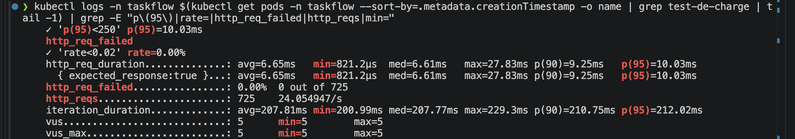

**Les analyses sur un seul écran (14:11).** Cette capture réunit l'AnalysisRun en échec de la 2.1.0 et celui en succès de la 2.2.0,
ainsi que les deux analyses faussées du matin :

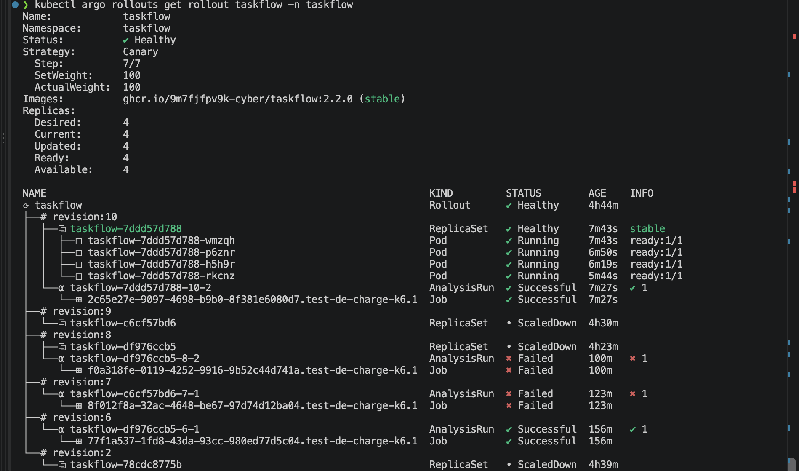

| Révision | Version déployée | AnalysisRun | Lecture |
|---|---|---|---|
| 10 | 2.2.0 | `taskflow-7ddd57d788-10-2` : **Successful** | la version corrigée est acceptée |
| 9 | 2.0.0 (revert) | aucune | la 2.0.0 tournait déjà, rien à déployer |
| 8 | 2.1.0 | `taskflow-df976ccb5-8-2` : **Failed** | la version boguée est refusée, après correction du test |
| 7 | 2.0.0 (revert) | `taskflow-c6cf57bd6-7-1` : Failed | à tort : le test visait les anciens pods, en 2.1.0 |
| 6 | 2.1.0 | `taskflow-df976ccb5-6-1` : Successful | à tort : le test visait les anciens pods, en 2.0.0 |

### Les rapports k6 côte à côte

| Test | Version réellement testée | Erreurs | p95 | Verdict |
|---|---|---|---|---|
| Étalon (11:17) | 2.0.0 | 0,00 % | 5,43 ms | seuils respectés |
| Analyse du 1er essai 2.1.0 (11:36) | 2.0.0, par erreur | 0,00 % | 7,75 ms | Successful, à tort |
| `charge.sh` sur la production (12:00) | 2.1.0 | 25,66 % | 307 ms | seuils dépassés |
| Analyse du revert (12:07) | 2.1.0, par erreur | 33,33 % | 308 ms | Failed, à tort |
| Analyse du 2e essai 2.1.0 (12:31) | 2.1.0 | 30,33 % | 312 ms | Failed, à raison |
| Analyse de la 2.2.0 (14:04) | 2.2.0 | 0,00 % | 10,03 ms | Successful, à raison |

### Ma méthode pour débloquer

1. **Comparer à l'étalon.** Le test « réussi » affichait 16 ms au maximum. La 2.1.0 ne répond jamais sous 300 ms. Ce chiffre m'a mis sur la piste.
2. **Mesurer avant de modifier.** J'avais deux idées de correction (tester une autre route, ajouter `abortOnFail`). Les mesures ont montré que ni l'une ni l'autre n'aurait rien changé.
3. **Une hypothèse à la fois, et une mesure pour la départager.** J'en ai écarté quatre. Elles sont dans le postmortem.
4. **Lire les journaux avec leurs heures.** C'est l'écart d'une seconde entre la bascule du Service et le démarrage de k6 qui a donné la cause.
5. **Corriger petit, puis refaire exactement le même essai.** Même version, même scénario, mêmes seuils : seul le résultat a changé.

### Ce qui m'a posé problème dans ce labo

- Voir un test vert et une production cassée en même temps. J'ai d'abord cru à une erreur de ma part dans les fichiers.
- Le revert bloqué par l'outil censé me protéger. Je ne savais pas qu'on pouvait finir un déploiement avec `promote --full`.
- Mes premières explications étaient fausses. Sans les mesures, j'aurais corrigé au mauvais endroit.
- La commande `get rollout` colore ses mots, et mes filtres ne les reconnaissaient plus. Il faut ajouter `--no-color`.

### Ce que je retiens

Un test automatique qui passe ne prouve rien si on ne sait pas ce qu'il a testé. Après correction, le filet de sécurité a fait son travail :
un pod exposé pendant 48 secondes, contre 44 minutes d'incident le matin.
